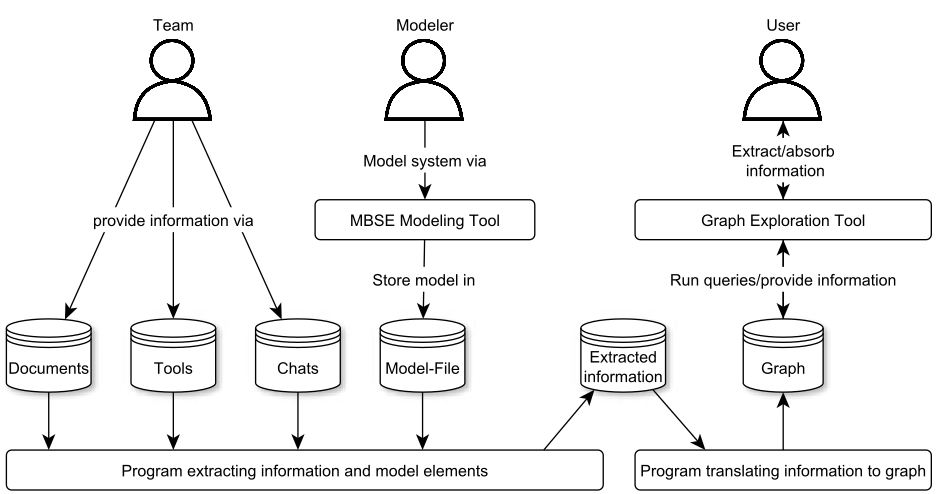
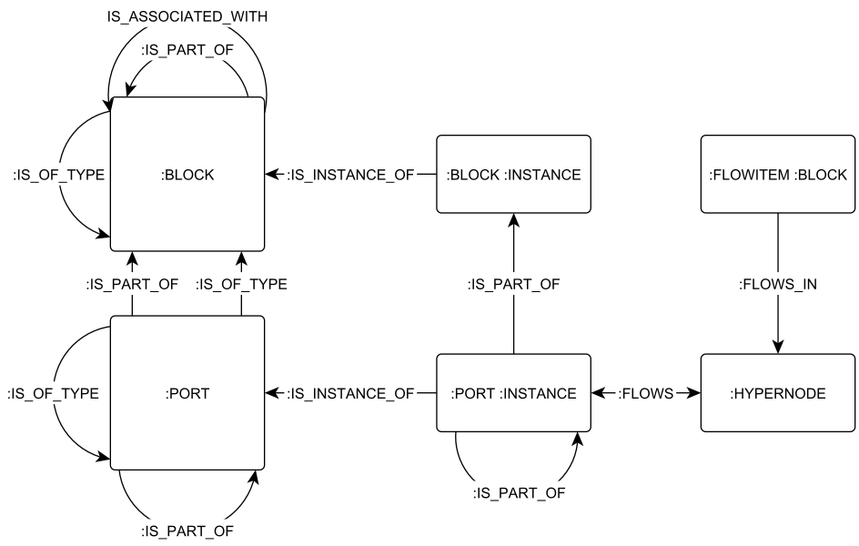
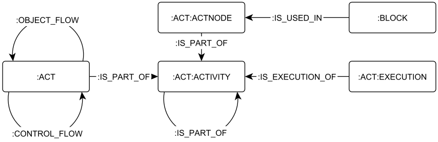
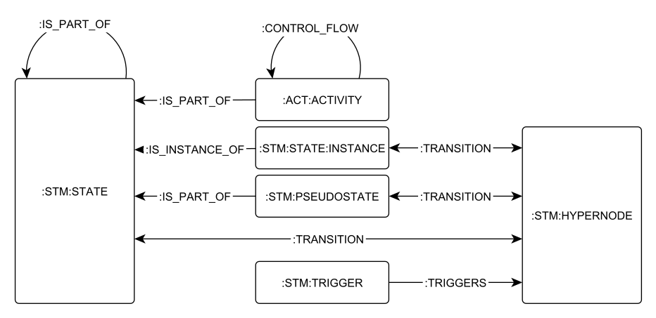
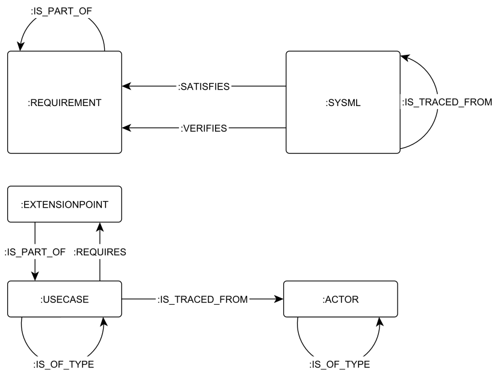
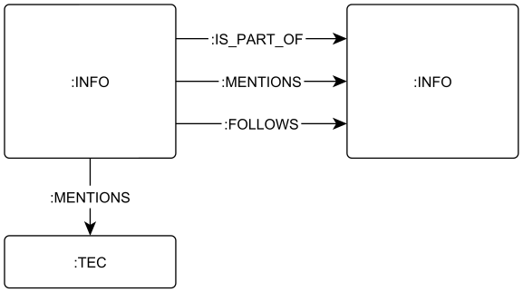
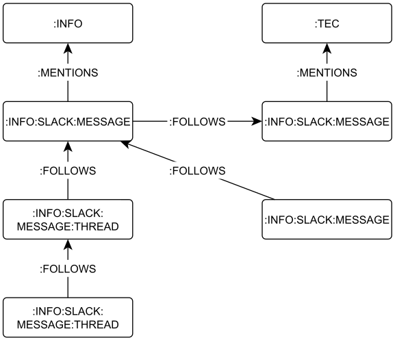
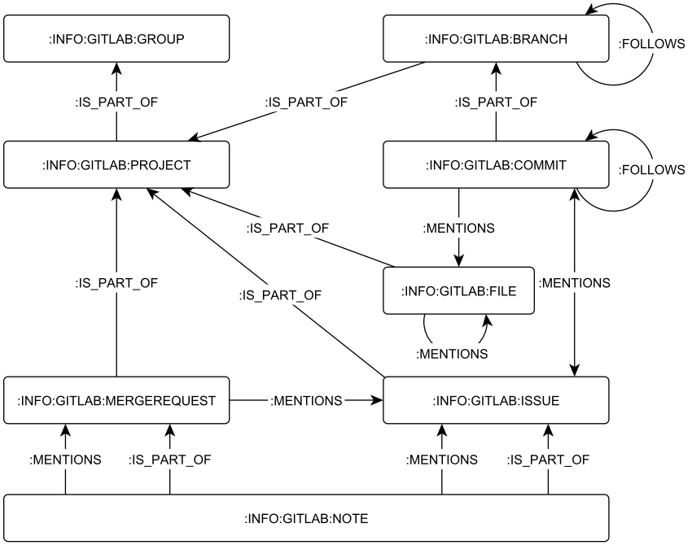

# SysML and Development Information Graph Analysis Tool

The tool can be used to transfer information from development projects to a [Neo4j](https://neo4j.com/download/) graph database instance.
Once in the graph database, the data can queried using the graph query language [Cypher](https://neo4j.com/developer/cypher/)
The following information can be transferred:
- SysML Models created in [MagicDraw v.19](https://docs.nomagic.com/display/MD190/19.0+LTR+Version+News), specifically the content related to the following diagram types:
  - Block Definition Diagrams
  - Internal Block Diagrams
  - Activity Diagrams
  - State Machines
  - Use Case Diagrams
  - Requirement Diagrams
- Not all information that could theoretically be modelled in these diagram types is being transferred. Further, the tool does not recognize custom stereotypes out of the box.

On a more experimental level the following information can also be transferred:
- All chats from the public channels of a [Slack](https://slack.com/) instance
- All information stored in classical file storage systems that is accessible to the tool and can be parsed by [Apache Tika](https://tika.apache.org/), e.g. MS Office documents, emails or pdf
- Groups, repositories, commits, merge requests, files, branches and users from a [GitLab](https://about.gitlab.com/) instance

The information is not only inserted into a Neo4j database but in the case of SysML, GitLab and Slack also correlated according to predefined schemata.
Specific instructions on how to use the tool can be found in the lower part of this readme.

## Organization of the Repo
The repo contains a folder `src`, in which all python scripts are stored.
The following figure shows a top level overview of the workflow.
While the team provides information on any of the above described communication paths, the information can be queried via the respective  `retrieve_<asset>.py`, which stores the information  in .json format.
In the following, an `insert_<asset>.py` transfers the information to the neo4j database.

The scripts for the respective assets build on a common set of functions stored in `custom_functions.py`.
They furthermore access the configuration stored in `conf.py` and the access-tokens stored under `crown_jewels.py`.
For the public version of the tool, no access tokens are provided.

## Requirements for Running the Code
- You need [Python3](https://www.python.org/doc/)
- Some libraries in python are required, all of them can be installed via pip
  - `pip install --upgrade slacker`
  - `pip install --upgrade python-gitlab`
  - `pip install --upgrade neo4j`
  - `pip install --upgrade tika`
- Additionally to the repo you need a running neo4j database (tested with v3.5.14, v3.5.17 and v4.0.3, cypher v3, v4)
- Apart from the code and the database you need access to the data to be integrated. i.e. magicdraw model, slack token, an export of mails, access to gitlab, google docs, trello, ...

# Setup Manual
## Database Setup
In case you want to create a new database in neo4j, use the following steps:
- Create a neo4j db isntance with up to date version
- Copy the neo4j.conf file into the settings of neo4j
- Install the APOC plugin

## Populating the Database
The following list of instructions shall work as an example of how to use the tool to populate a database
- Place the files in the respective folders
  - The MBSE Model should be in the `src/magicdraw` directory
  - Any kind of classical files should be in a directory consistent to `src/conf.py`
- Start the database and make sure that the neo4j username and neo4j password and uri stored in `src/crown_jewels.py`match the database.
- Run the script `MagicDraw_adapter_main.py`
- If the script executed successfully, you can find nodes in the database with the labels `:SYSML:TEC`
- For all other data types the respective scripts should be executed in the following sequence: `retrieve_<asset>.py` :arrow_right: `insert_<asset>.py`:arrow_right: `relate_<asset>.py`

#  Graph Schema
The following figures show the graph schema for various data sources.

## MBSE Model

### bdd and ibd schema

### act schema

### stm schema

### req schema

## Info  Schema

### Slack schema

### GitLab schema

